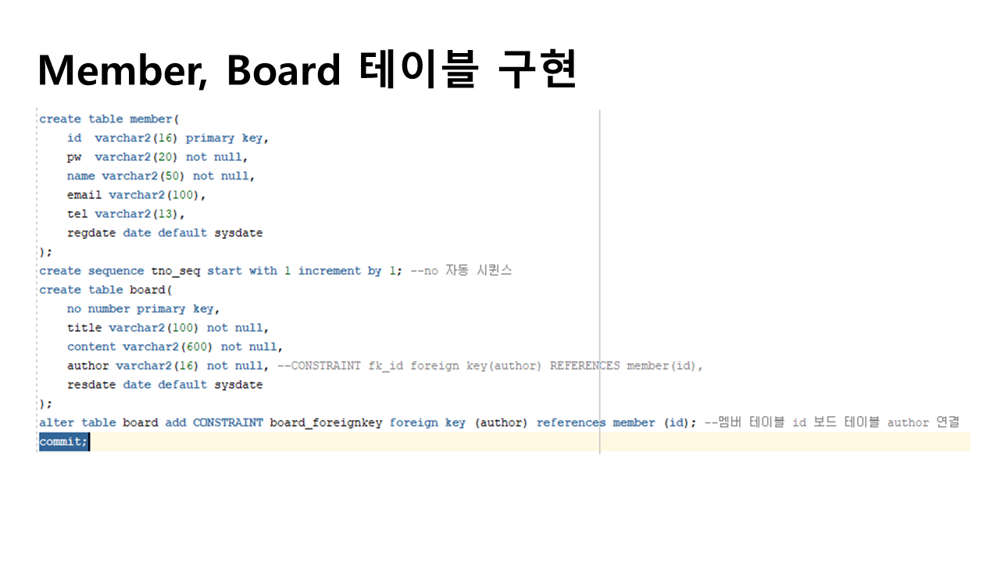

# 프로젝트
## 프로젝트 개요
기업 "LG DISPLAY"를 모티브로 하여 가상의 기업의 홈페이지를 주제로 정한 후 사전에 먼저 페이퍼 프로토 타입을 이용해 프론트 엔드 부분의 전체적인 틀을 먼저 설계 한 뒤 여기서 설계한 내용을 바탕으로 먼저  html 문서 형식으로 프론트 엔드 부분을 작성하였습니다.
 여기서 작성된 프론트 엔드 부분을 바탕으로 이클립스를 사용해 oracledb와 jsp를 활용해 홈페이지를 만들었습니다. 오라클을 이용해 회원가입을 받고 로그인을 처리할 'member' 테이블을 먼저 만들었고 게시판 사용을 처리하기 위한 'board' 테이블 도 만들었습니다.
 그 후 jsp를 이용하여 oracledb에 만들어둔 테이블을 바탕으로 로그인, 로그아웃, 회원관리, 마이페이지 등의 사용자 접근, 접근권한에 관련된 기능을 만들어 보았으며 그 이후에는 간단한 게시판을 만들어 글 읽기, 글 쓰기, 글 수정, 글 삭제 등의 기능을 구현해 보았습니다.	 

## 프로젝트 설계 PPT

  

