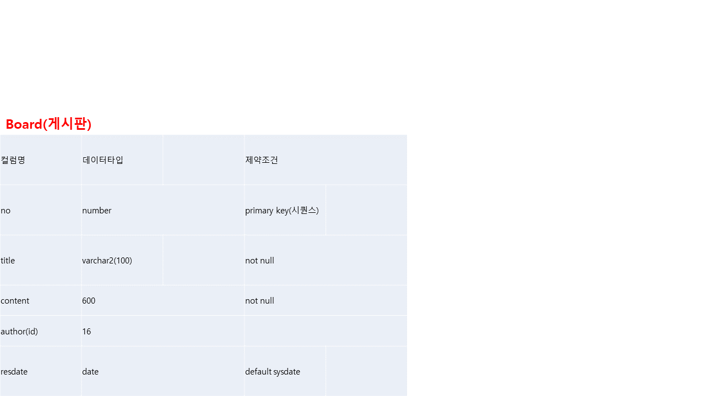
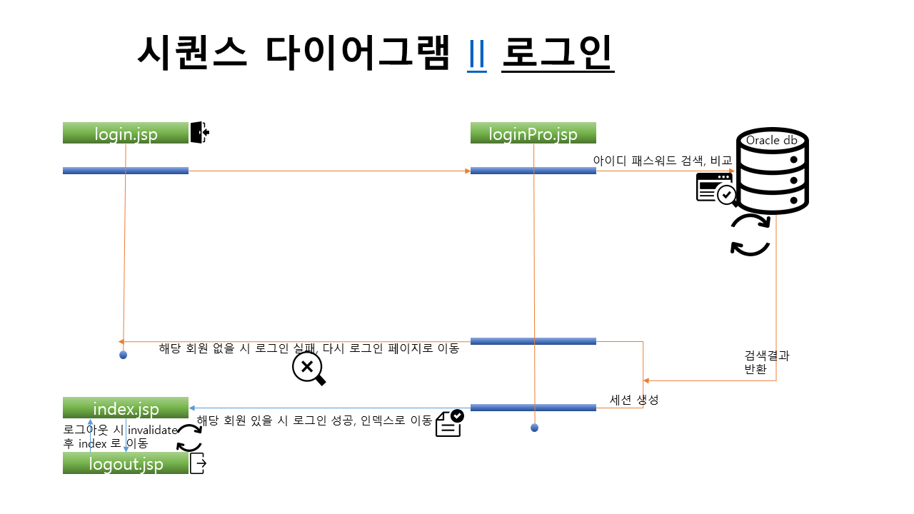

# 프로젝트
## 프로젝트 개요
"LG DISPLAY" 를 바탕으로 가상의 기업의 홈페이지를 주제로 하여 사전에 먼저 페이퍼 프로토 타입을 이용하여 프론트 엔드 부분의 틀을 먼저 설계 한뒤 설계한 내용을 바탕으로 먼저  html 문서 형식으로 프론트 엔드 부분을 작성하였습니다.
 그 후 이클립스,jsp,oracle을 연계하여

## 프로젝트 설계 PPT

  

